# 3PL Inbound Onboarding Automation

**Mars Navision Integration · EOS Transformation Delivery Team**

Automates the end-to-end configuration required to onboard a new 3PL partner for inbound message flows into Mars Navision (1Nav) via MuleSoft. A single onboarding JSON drives all downstream configuration: YAML patching across all environments, SharePoint translation table rows, and (in progress) BTP/Solace API calls.

---

## Table of Contents

1. [Overview](#overview)
2. [What's New — v2 (Modular Tools)](#whats-new--v2-modular-tools)
3. [Tech Stack](#tech-stack)
4. [Repository Structure](#repository-structure)
5. [End-to-End Automation Flow](#end-to-end-automation-flow)
6. [Modular Tool Architecture](#modular-tool-architecture)
7. [REST API Endpoints](#rest-api-endpoints)
8. [Architecture & Flow Diagrams (HLD & LLD)](#architecture--flow-diagrams-hld--lld)
   - 8.1 [HLD — System Architecture](#hld--system-architecture)
   - 8.2 [HLD — Component Dependency Map](#hld--component-dependency-map)
   - 8.3 [HLD — End-to-End User Journey](#hld--end-to-end-user-journey)
   - 8.4 [LLD — POST /api/run Request Sequence](#lld--post-apirun-request-sequence)
   - 8.5 [LLD — POST /api/orchestrate Full 10-Step Sequence](#lld--post-apiorchestrate-full-10-step-sequence)
   - 8.6 [LLD — POST /api/tools/{key} Standalone Tool Sequence](#lld--post-apitoolskey-standalone-tool-sequence)
   - 8.7 [LLD — Browser Dual Submit Flow](#lld--browser-dual-submit-flow)
   - 8.8 [LLD — GitHub Device Code Login Flow](#lld--github-device-code-login-flow)
   - 8.9 [LLD — YAML Patching Logic (3-Pass Strategy)](#lld--yaml-patching-logic-3-pass-strategy)
   - 8.10 [LLD — Orchestrator 10-Step Pipeline](#lld--orchestrator-10-step-pipeline)
   - 8.11 [LLD — GET /api/download Security Chain](#lld--get-apidownload-security-chain)
   - 8.12 [LLD — Data Model](#lld--data-model)
   - 8.13 [LLD — File Store Layout](#lld--file-store-layout)
9. [Quick Start — Web App](#quick-start--web-app-recommended)
10. [Quick Start — Python CLI](#quick-start--python-cli)
11. [Input JSON Schema](#input-json-schema)
12. [MuleSoft YAML — What Gets Updated](#mulesoft-yaml--what-gets-updated)
13. [Translation Table — What Gets Generated](#translation-table--what-gets-generated)
14. [Team Dependencies & Open Items](#team-dependencies--open-items)
15. [Azure Deployment](#azure-deployment)
16. [Contributing](#contributing)

---

## What's New — v2 (Modular Tools)

> Released: 2026-05-20 · Branch: `main`

| Area | Change |
|---|---|
| **Input** | Form now collects **SAP BTP**, **Solace**, and **GitHub** credentials in addition to MuleSoft NAV details |
| **Run modes** | Two submit buttons: **YAML + Translation** (fast, Steps 7+8 only) and **Full Orchestration** (all 10 steps) |
| **Tools Dashboard** | New page at `/tools` — step registry with status, owner, blocked-on info, and API reference |
| **Tool endpoints** | `POST /api/tools/{key}` for every step; implemented tools run logic, stubs return `HTTP 501` with blocked-on detail |
| **Step registry** | `webapp/lib/steps/registry.ts` is the single source of truth for step metadata; `GET /api/steps` exposes it |
| **Orchestrator** | Reads BTP/Solace/GitHub config from form input first, env vars as server-level fallback |
| **Types** | `BtpInput`, `SolaceInput`, `GitHubInput` added to `OnboardingInput` |
| **Navigation** | Top nav bar links: *New Onboarding* and *Tools Dashboard* |
| **GitHub Device Login** | One-click GitHub OAuth Device Flow inside the GitHub section — no PAT copy-paste; token auto-fills the field |
| **GitHub API routes** | `POST /api/github/device-start` and `POST /api/github/device-poll` proxy the Device Flow; token never stored server-side |

---

## Overview

When a new 3PL partner (e.g. SPL France) needs to send inbound messages to Mars Navision, the following systems must each be configured manually today:

| System | Configuration needed | Today | Target |
|---|---|---|---|
| SAP BTP | Register app, generate ClientID/Secret, insert ValueMapping | Manual | Semi-automated (D3 gate) |
| Solace | Add enum/event/app versions in Event Portal, patch queue subscription | Manual | Automated via Solace API |
| MuleSoft | Patch all env YAMLs, add SharePoint translation rows | Manual | **Automated — done** |
| GitHub | Create feature branch, raise PR, notify reviewer | Manual | Automated via GitHub API |

This repository automates the **MuleSoft layer** fully (patching `app.yaml`, `dev.yaml`, `tst.yaml`, `prod.yaml` in a single run), provides the tracker and requirements Excel for all teams, and is designed to grow into a full orchestration layer as BTP and Solace APIs are confirmed.

---

## Tech Stack

| Layer | Technology |
|---|---|
| Web App Framework | Next.js 15 (App Router) |
| Language | TypeScript |
| UI | React 19 |
| Styling | Tailwind CSS 3 |
| Excel generation | ExcelJS |
| CLI scripts | Python 3.13 + openpyxl |
| Deployment | Azure App Service (Node 20 LTS) |

---

## Repository Structure

```
3pl-automation/
│
├── README.md
├── .gitignore
│
├── config/                                 ← source configuration files
│   ├── dev.yaml                            ← DEV env overlay (nav blocks)
│   └── sample_onboarding_input.json        ← onboarding input template
│
├── scripts/                                ← Python CLI tools
│   ├── requirements.txt
│   ├── patch_config.py                     ← Steps 7+8: patch YAML + generate translations (DONE)
│   ├── orchestrator.py                     ← run all 10 steps in sequence (skips TODO steps)
│   ├── create_tracker_excel.py
│   ├── create_onboarding_excel.py
│   └── steps/
│       ├── __init__.py                     ← step status table
│       ├── step1_btp_app_creation.py       ← TODO: BTP App create (Parag Shende)
│       ├── step2_btp_value_mapping.py      ← TODO: BTP ValueMapping Upsert/Deploy (Parag Shende)
│       ├── step3_solace_event_portal.py    ← TODO: Solace Event Portal 5-call seq (Rohini Mondal)
│       ├── step4_solace_queue_patch.py     ← TODO: Solace SEMP queue subscription (Rohini Mondal)
│       ├── step5_solace_git_input.py       ← TODO: Solace Git branch + input.json (Rohini + DevOps)
│       ├── step6_mule_feature_branch.py    ← TODO: Mule feature branch (Sravani Kare + DevOps)
│       └── step9_mule_pr_notify.py         ← TODO: Mule PR + reviewer notify (Sravani Kare)
│
├── docs/
│   ├── 3PL_Integration_Automation_Tracker.xlsx
│   └── 3PL_Inbound_Onboarding_Requirements.xlsx
│
├── outputs/                                ← generated files (gitignored)
│
└── webapp/                                 ← Next.js 15 web application
    ├── app/
    │   ├── layout.tsx                      ← nav bar with links to Onboarding + Tools Dashboard
    │   ├── globals.css
    │   ├── page.tsx                        ← onboarding form (7 sections: Partner + NAV + TX + Trans + BTP + Solace + GitHub)
    │   ├── result/[runId]/page.tsx         ← results: YAML previews per env + download buttons
    │   ├── tools/page.tsx                  ← Tools Dashboard: step cards, status, API reference
    │   └── api/
    │       ├── run/route.ts                ← POST: validate → patch all YAMLs → generate files
    │       ├── orchestrate/route.ts        ← POST: run all 10 steps (BTP/Solace/GitHub from input or env)
    │       ├── steps/route.ts              ← GET: return full step registry
    │       ├── result/[runId]/route.ts     ← GET: fetch run metadata
    │       ├── download/[runId]/[type]/route.ts  ← GET: stream yaml/app-yaml/tst-yaml/prod-yaml/xlsx/csv
    │       └── tools/                      ← one route per step
    │           ├── yaml-patch/route.ts     ← POST Step 7 standalone (implemented)
    │           ├── translation/route.ts    ← POST Step 8 standalone (implemented)
    │           ├── btp-app/route.ts        ← POST Step 1 (501 stub)
    │           ├── btp-valuemap/route.ts   ← POST Step 2 (501 stub)
    │           ├── solace-portal/route.ts  ← POST Step 3 (501 stub)
    │           ├── solace-queue/route.ts   ← POST Step 4 (501 stub)
    │           ├── solace-git/route.ts     ← POST Step 5 (501 stub)
    │           ├── mule-branch/route.ts    ← POST Step 6 (501 stub)
    │           └── mule-pr/route.ts        ← POST Step 9 (501 stub)
    ├── lib/
    │   ├── types.ts                        ← OnboardingInput (+ BtpInput, SolaceInput, GitHubInput),
    │   │                                      EnvNavConfig, RunResult, TranslationRow, ToolResult
    │   ├── constants.ts                    ← VALID_TX_CODES, TX_CODE_ORDER, TRANSLATION_COLUMNS
    │   ├── validate.ts                     ← server-side validation (all fields incl. nav_tst/nav_prod)
    │   ├── core.ts                         ← buildYamlBlock, buildYamlBlockForEnv, patchYaml,
    │   │                                      patchValidCountriesList, patchNavisionInstance,
    │   │                                      buildTranslationRows, buildCsv
    │   ├── fileStore.ts                    ← saveRunFiles, getFilePath, getEnvYamlPath, buildExcelBuffer
    │   ├── orchestrator.ts                 ← 10-step orchestrator with safeRun wrapper
    │   │                                      (reads BTP/Solace/GitHub from input.btp/solace/github first)
    │   ├── security.ts                     ← rate limiting, UUID guard, path traversal, sanitizers,
    │   │                                      CSRF, secure headers, error redaction
    │   └── steps/
    │       ├── registry.ts                 ← STEP_REGISTRY: single source of truth for all step metadata
    │       ├── step1-btp-app.ts            ← STUB: BTP App creation (Parag Shende)
    │       ├── step2-btp-valuemap.ts       ← STUB: BTP Value Mapping (Parag Shende)
    │       ├── step3-solace-portal.ts      ← STUB: Solace Event Portal (Rohini Mondal)
    │       ├── step4-solace-queue.ts       ← STUB: Solace Queue Patch (Rohini Mondal)
    │       ├── step5-solace-git.ts         ← STUB: Solace Git (Rohini Mondal + DevOps)
    │       ├── step6-mule-branch.ts        ← STUB: Mule Feature Branch (Sravani Kare)
    │       └── step9-mule-pr.ts            ← STUB: Mule PR + Notify (Sravani Kare)
    ├── data/
    │   ├── app.yaml    ← main properties file: validCountriesList + navision.instance + nav blocks
    │   ├── dev.yaml    ← DEV env overlay (nav blocks + Solace dev broker)
    │   ├── tst.yaml    ← TST env overlay (nav blocks + Solace tst broker)
    │   └── prod.yaml   ← PROD env overlay (optional — add when PROD details available)
    ├── outputs/                            ← web app run outputs (gitignored)
    ├── package.json
    ├── tsconfig.json
    ├── next.config.ts                      ← standalone output + exceljs serverExternalPackages
    ├── tailwind.config.ts
    ├── startup.txt                         ← Azure App Service startup command
    └── .gitignore
```

---

## End-to-End Automation Flow

```
[INTAKE]
Fill in config/sample_onboarding_input.json  (country_key, country_code, nav, nav_tst, nav_prod, translation)
(or use the web form at http://localhost:3000)
        |
        v
[VALIDATE]
All mandatory fields checked before any file is touched
        |
        v
[STEP 1 — BTP: App Creation]                         STATUS: MANUAL (interim)
  Register application on BTP Developer Portal
  Generate ClientID + Secret
  D3 Human-in-the-loop approval gate
  ► API available, pending D3 decision & Parag Shende Postman collection
        |
        ClientID  ──────────────────────────────────────────────────────┐
        v                                                                │
[STEP 2 — BTP: ValueMapping]                         STATUS: AUTOMATED (API confirmed, keys pending)
  POST UpsertValMaps                                                     │
  POST SaveAsVersion                                                     │
  POST DeployValueMappingsDesigntimeArtifact                            │
  ► Parag Shende to share Postman collection + Service Key              │
        |                                                                │
        v                                                                │
[STEP 3 — SOLACE: Event Portal Design]               STATUS: AUTOMATED (APIs known, creds pending)
  GET/POST Enum version (add country code)                              │
  GET/POST Event version                                                 │
  GET/POST Producer App version                                         │
  GET/POST Consumer App version + subscriptions                         │
  POST Dev Promotion Request                                            │
  ► Rohini Mondal to share API token + object IDs                       │
        |                                                                │
        v                                                                │
[STEP 4 — SOLACE: Queue Subscription Patch]          STATUS: AUTOMATED (SEMP endpoint TBD)
  PATCH existing queue — append new topic subscription rule             │
  ► Rohini Mondal to confirm SEMP endpoint + snapshot of existing subs  │
        |                                                                │
        v                                                                │
[STEP 5 — SOLACE: Feature Branch + input.json]       STATUS: MANUAL → AUTOMATED
  Create Git feature branch via GitHub API                              │
  Populate input.json for GitHub Actions pipeline                       │
  ► Rohini Mondal + DevOps: repo URL, file path, branch naming         │
        |                                                                │
        v                                                                │
[STEP 6 — MULESOFT: Feature Branch]                  STATUS: MANUAL (interim)
  Developer creates branch manually today                               │
  Azure Service Principal with branch-create rights needed             │
  ► Sravani Kare + DevOps to provision Service Principal               │
        |                                                                │
        v                                                                v
[STEP 7 — MULESOFT: Patch app.yaml + dev.yaml + tst.yaml + prod.yaml]  STATUS: AUTOMATED ✅ DONE
  app.yaml  → validCountriesList += country_code
             navision.instance   += code: "country_key"
             nav block appended
  dev.yaml  → nav block appended (DEV server details)
  tst.yaml  → nav block appended (TST-specific host/company/soap/routing)
  prod.yaml → nav block appended (PROD-specific, if nav_prod provided)
  Duplicate-key guard on every file; all existing content preserved
        |
        v
[STEP 8 — MULESOFT: Translation Table]               STATUS: AUTOMATED ✅ DONE
  Generates SharePoint Translation List rows
  Output → outputs/{runId}/translations.xlsx + .csv
        |
        v
[STEP 9 — MULESOFT: Raise PR + Notify]               STATUS: TO BUILD (GitHub API ready)
  Commit patched YAMLs to feature branch
  POST GitHub API: create pull request
  Send email/Teams notification to Sravani Kare
        |
        v
[STEP 10 — MULESOFT: DEV Deployment]                 STATUS: MANUAL (review gate)
  Sravani reviews PR → approves → merges → DEV deploys
```

---

## Modular Tool Architecture

Every automation step is independently callable as a REST tool. The step registry (`webapp/lib/steps/registry.ts`) is the single source of truth — it powers the Tools Dashboard UI, the `GET /api/steps` endpoint, and inline documentation for each stub.

### Step Registry

| Step | Key | Status | Owner | Requires |
|---|---|---|---|---|
| 1 | `btp-app` | Stub | Parag Shende | `btp`, `translation` |
| 2 | `btp-valuemap` | Stub | Parag Shende | `btp`, `translation` |
| 3 | `solace-portal` | Stub | Rohini Mondal | `solace`, `translation` |
| 4 | `solace-queue` | Stub | Rohini Mondal | `solace`, `translation` |
| 5 | `solace-git` | Stub | Rohini Mondal / DevOps | `solace`, `github`, `translation` |
| 6 | `mule-branch` | Stub | Sravani Kare / DevOps | `github` |
| 7 | `yaml-patch` | **Implemented** | EOS Automation | `nav`, `translation` |
| 8 | `translation` | **Implemented** | EOS Automation | `nav`, `translation` |
| 9 | `mule-pr` | Stub | Sravani Kare | `github`, `nav` |
| 10 | `sharepoint-review` | Manual | Business / Ops | `translation` |

### Input Sections

The `OnboardingInput` type is divided into logical sections. Each section feeds specific steps:

| Section field | Type | Used by |
|---|---|---|
| `country_key`, `country_code`, `nav` | Core | Steps 7, 8 |
| `nav_tst`, `nav_prod` | Optional nav overrides | Step 7 (tst.yaml, prod.yaml) |
| `translation` | BTP ClientID + mappings | Steps 1, 2, 3, 4, 8 |
| `btp?` | SAP BTP credentials | Steps 1, 2 |
| `solace?` | Solace EP + broker config | Steps 3, 4, 5 |
| `github?` | GitHub PAT + repo config | Steps 5, 6, 9 |

### How to Implement a Stubbed Step

1. Open `webapp/lib/steps/step{N}-*.ts` — the `run()` function is the only thing to fill in.
2. Use the typed params already defined in the same file; no interface changes needed.
3. Set the corresponding env vars (see env-var table below) as server-level fallbacks for deployed instances. User-provided form fields always take priority.
4. Mirror the change in the Python equivalent under `scripts/steps/`.
5. Update `registry.ts`: change `status: 'stub'` → `status: 'implemented'`.
6. The Tools Dashboard and `GET /api/steps` will automatically reflect the new status.

### Config Priority

The orchestrator reads integration credentials in this order:

```
1. input.btp.apiHost  / input.solace.epApiToken  / input.github.githubPat  (user-provided via form)
2. process.env.BTP_API_HOST / SOLACE_EP_API_TOKEN / GITHUB_PAT            (server env vars)
3. "" (empty string — step will be skipped / throw "not implemented")
```

---

## REST API Endpoints

### Core Endpoints

| Method | Path | Description |
|---|---|---|
| `POST` | `/api/run` | Steps 7+8 only: validate → patch YAMLs → generate translation files. Returns `RunResult`. |
| `POST` | `/api/orchestrate` | All 10 steps. Stubs skipped automatically. Returns `OrchestrationResult`. |
| `GET` | `/api/steps` | Returns the full `STEP_REGISTRY` array (powers the Tools Dashboard). |
| `GET` | `/api/result/{runId}` | Load run metadata by UUID run ID. |
| `GET` | `/api/download/{runId}/{type}` | Download file. `type` ∈ `yaml`, `app-yaml`, `tst-yaml`, `prod-yaml`, `xlsx`, `csv`. |
| `POST` | `/api/github/device-start` | Initiate GitHub Device Code Flow. Returns `{ device_code, user_code, verification_uri, expires_in, interval }`. Requires `GITHUB_OAUTH_CLIENT_ID`. |
| `POST` | `/api/github/device-poll` | Poll for token. Body: `{ device_code }`. Returns `{ status: pending|slow_down|authorized|expired|denied }`. Token never stored server-side. |

### Tool Endpoints

Each step has a standalone `POST /api/tools/{key}` endpoint:

| Endpoint | Step | Status | Notes |
|---|---|---|---|
| `POST /api/tools/yaml-patch` | 7 | Ready | Patches all applicable YAMLs, saves files, returns run_id |
| `POST /api/tools/translation` | 8 | Ready | Generates translation rows, saves Excel+CSV, returns run_id |
| `POST /api/tools/btp-app` | 1 | `HTTP 501` | Returns stub info + blockedOn detail |
| `POST /api/tools/btp-valuemap` | 2 | `HTTP 501` | Returns stub info + blockedOn detail |
| `POST /api/tools/solace-portal` | 3 | `HTTP 501` | Returns stub info + blockedOn detail |
| `POST /api/tools/solace-queue` | 4 | `HTTP 501` | Returns stub info + blockedOn detail |
| `POST /api/tools/solace-git` | 5 | `HTTP 501` | Returns stub info + blockedOn detail |
| `POST /api/tools/mule-branch` | 6 | `HTTP 501` | Returns stub info + blockedOn detail |
| `POST /api/tools/mule-pr` | 9 | `HTTP 501` | Returns stub info + blockedOn detail |

All endpoints accept `Content-Type: application/json` with `OnboardingInput` as the request body. All endpoints return security headers and are rate-limited.

---

## Architecture & Flow Diagrams (HLD & LLD)

> Diagrams use [Mermaid](https://mermaid.js.org/) syntax. Render in GitHub, VSCode Markdown Preview, or [mermaid.live](https://mermaid.live).

---

### HLD — System Architecture

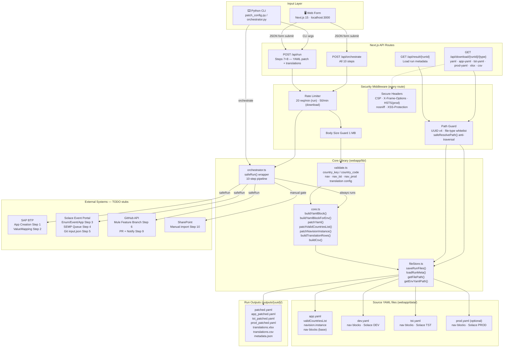

---

### HLD — Component Dependency Map

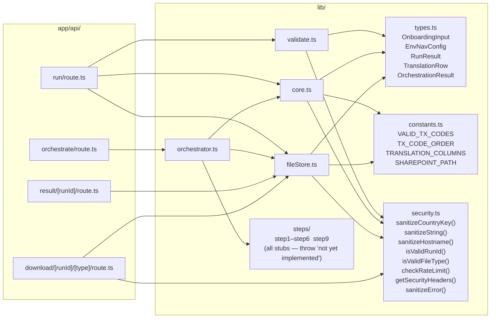

---

### HLD — End-to-End User Journey

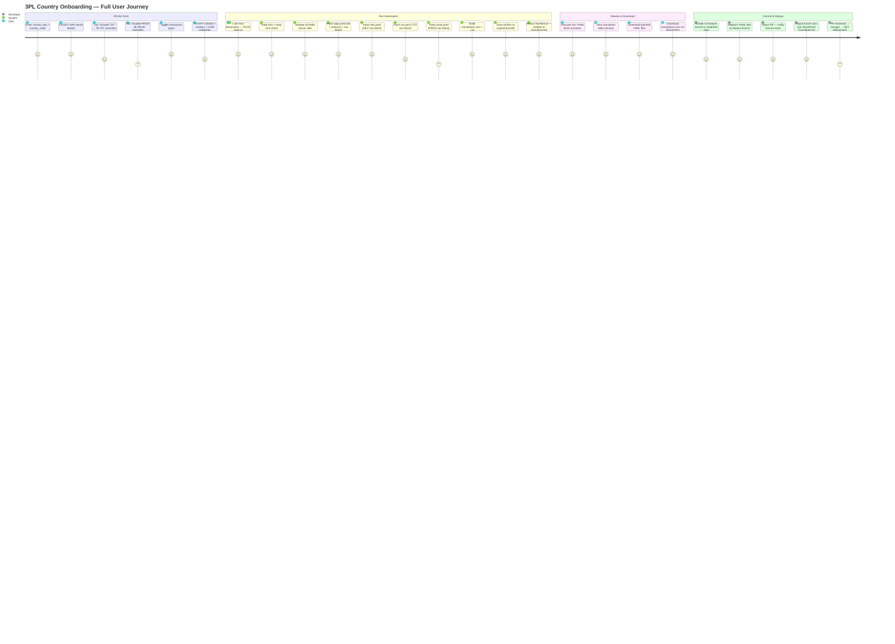

---

### LLD — POST /api/run Request Sequence

```mermaid
sequenceDiagram
    actor U as Browser / CLI
    participant RT as /api/run
    participant SEC as security.ts
    participant VAL as validate.ts
    participant CR as core.ts
    participant FS as fileStore.ts
    participant DISK as File System

    U->>RT: POST /api/run {OnboardingInput JSON}

    RT->>SEC: getClientIdentifier(headers)
    RT->>SEC: checkRateLimit(clientId, 20, 60s)
    alt Rate limit exceeded
        SEC-->>U: 429  Retry-After: Ns
    end

    RT->>RT: req.text() — assert length ≤ 1 MB
    alt Body too large
        RT-->>U: 413  Request body too large
    end
    RT->>RT: JSON.parse(text) → OnboardingInput

    RT->>VAL: validate(data)
    Note over VAL: country_key [a-z]+ max 50<br/>country_code [a-z0-9]+ max 10<br/>nav.host sanitizeHostname() — SSRF blocked<br/>nav.soap_path regex<br/>nav.routing_code [A-Z0-9_-]+<br/>nav_tst? — host/company/soap/routing<br/>nav_prod? — host/company/soap/routing<br/>translation.receiver_name [a-z0-9-]+
    alt Validation errors
        VAL-->>U: 422  {errors}
    end

    Note over RT: ── Build nav blocks ──
    RT->>CR: buildYamlBlock(data) → devBlock
    opt nav_tst provided
        RT->>CR: buildYamlBlockForEnv(data, nav_tst) → tstBlock
    end
    opt nav_prod provided
        RT->>CR: buildYamlBlockForEnv(data, nav_prod) → prodBlock
    end

    Note over RT: ── Patch dev.yaml ──
    RT->>FS: getDefaultYamlPath() → dev.yaml
    RT->>DISK: readFileSync(dev.yaml)
    RT->>CR: patchYaml(devYaml, countryKey, devBlock)
    alt Country key already in dev.yaml
        CR-->>U: 422  {country_key: "already exists"}
    end

    Note over RT: ── Patch app.yaml (3 passes) ──
    opt getEnvYamlPath('app') found
        RT->>DISK: readFileSync(app.yaml)
        RT->>CR: patchValidCountriesList(appYaml, countryCode)
        Note over CR: Finds validCountriesList:"…"<br/>Appends ,{code}  or silently skips if key absent<br/>Throws if duplicate
        RT->>CR: patchNavisionInstance(appYaml, code, key)
        Note over CR: Finds instance: block<br/>Appends 4-space entry  or silently skips<br/>Throws if duplicate
        RT->>CR: patchYaml(appYaml, countryKey, devBlock)
    end

    Note over RT: ── Patch tst.yaml ──
    opt nav_tst provided AND tst.yaml found
        RT->>DISK: readFileSync(tst.yaml)
        RT->>CR: patchYaml(tstYaml, countryKey, tstBlock)
    end

    Note over RT: ── Patch prod.yaml ──
    opt nav_prod provided AND prod.yaml found
        RT->>DISK: readFileSync(prod.yaml)
        RT->>CR: patchYaml(prodYaml, countryKey, prodBlock)
    end

    Note over RT: ── Translations ──
    RT->>CR: buildTranslationRows(data) → rows[]
    Note over CR: Cross-product: msgTypes × src/dest combos<br/>+ msgTypes × uom_mappings<br/>All values sanitized; CSV injection stripped
    alt rows > 10 000
        RT-->>U: 422  Too many translation rows
    end
    RT->>FS: buildExcelBuffer(rows) — ExcelJS server-side (lazy import)
    RT->>CR: buildCsv(rows) — double-quote all values

    Note over RT: ── Persist ──
    RT->>RT: uuidv4() → runId
    RT->>FS: ensureOutputRoot()
    RT->>FS: saveRunFiles(runId, meta, devYaml, xlsx, csv, appYaml?, tstYaml?, prodYaml?)
    FS->>DISK: mkdir outputs/{runId}/  mode 0o750
    FS->>DISK: metadata.json           mode 0o640
    FS->>DISK: patched.yaml            mode 0o640
    FS->>DISK: app_patched.yaml        (if present)
    FS->>DISK: tst_patched.yaml        (if present)
    FS->>DISK: prod_patched.yaml       (if present)
    FS->>DISK: translations.xlsx       mode 0o640
    FS->>DISK: translations.csv        mode 0o640

    RT-->>U: 200  RunResult {run_id, yaml_block, app_yaml_block?, tst_yaml_block?, …}
    U->>U: navigate → /result/{run_id}
```

---

### LLD — POST /api/orchestrate Full 10-Step Sequence

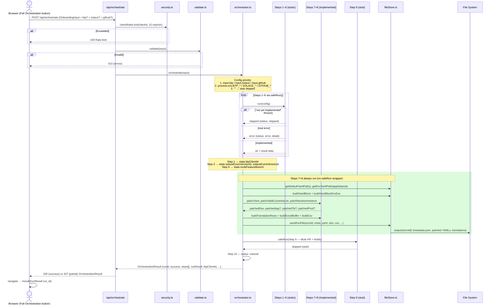

---

### LLD — POST /api/tools/{key} Standalone Tool Sequence

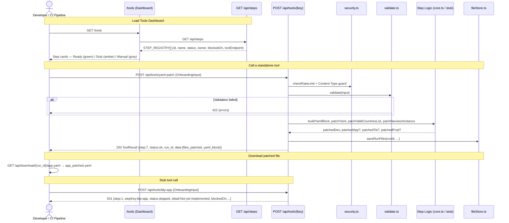

---

### LLD — Browser Dual Submit Flow

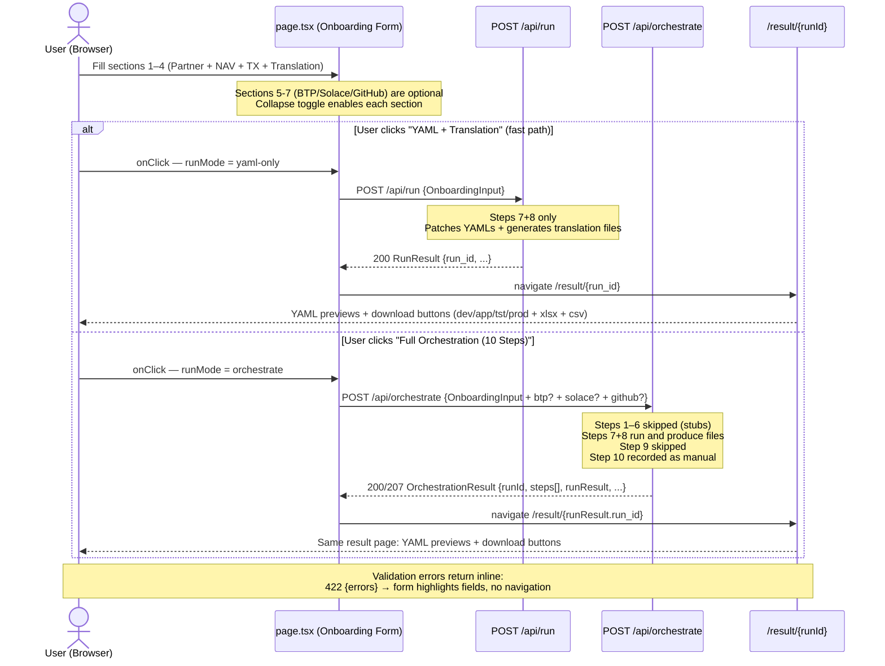

---

### LLD — GitHub Device Code Login Flow

> Requires: `GITHUB_OAUTH_CLIENT_ID` env var. Token is **never stored server-side** — it passes directly to the client and auto-fills the PAT field.

#### GitHub OAuth App Setup

1. Go to **GitHub → Settings → Developer settings → OAuth Apps → New OAuth App**
2. Fill in:
   - **Application name:** `3PL Onboarding Automation`
   - **Homepage URL:** `http://localhost:3000` (or your Azure App Service URL)
   - **Authorization callback URL:** leave blank (not needed for Device Flow)
3. Tick **"Enable Device Authorization Flow"** checkbox
4. Click **Register application** → copy the **Client ID**
5. Set `GITHUB_OAUTH_CLIENT_ID=<Client ID>` in `.env.local` (never a client secret — Device Flow doesn't need one)

#### Sequence Diagram

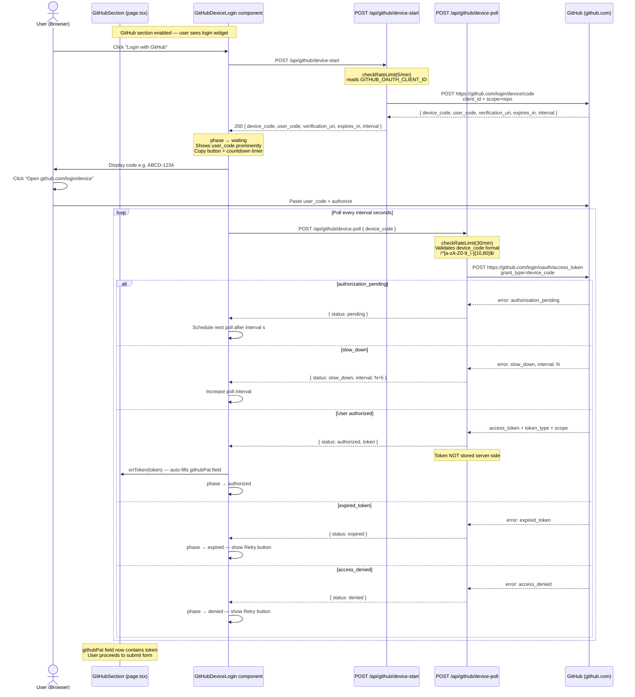

---

### LLD — YAML Patching Logic (3-Pass Strategy)

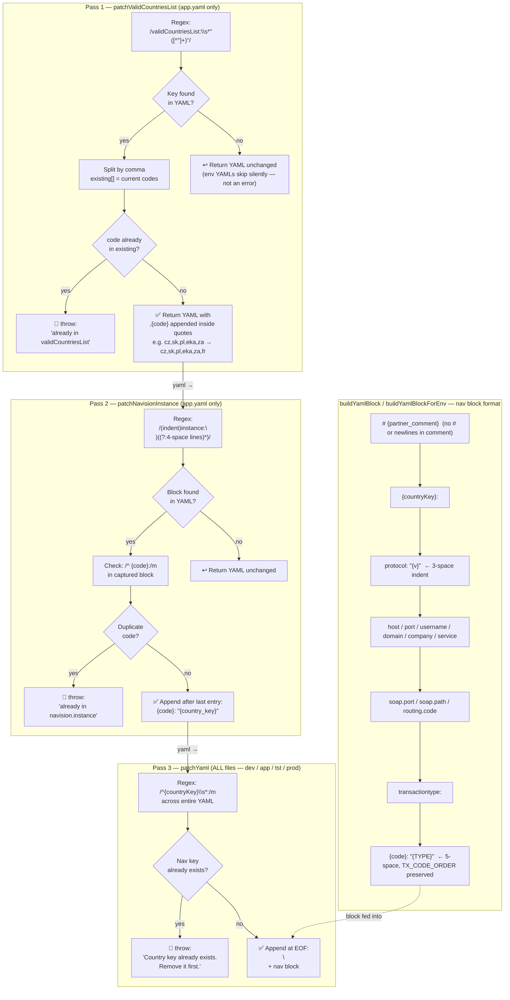

---

### LLD — Orchestrator 10-Step Pipeline

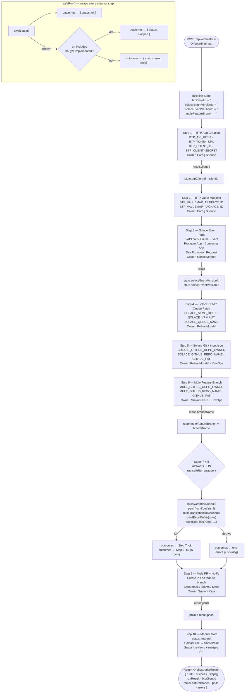

---

### LLD — GET /api/download Security Chain

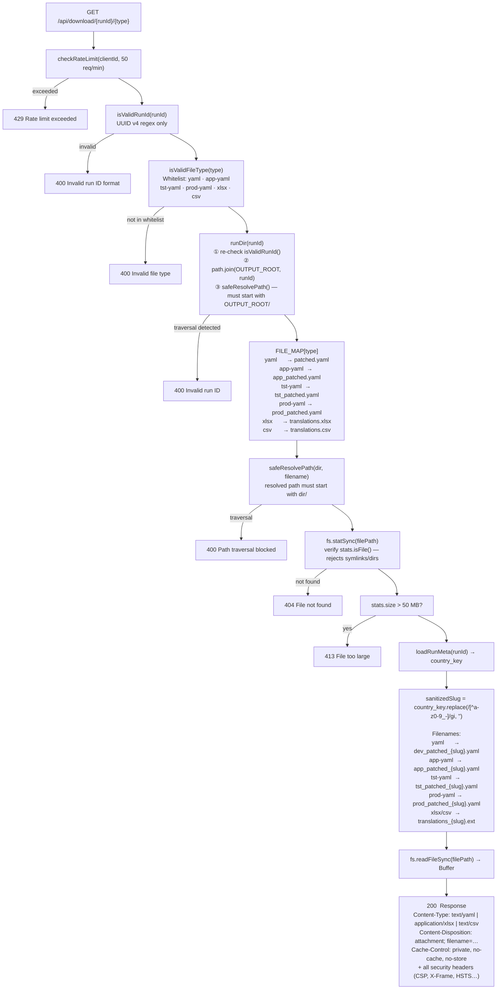

---

### LLD — Data Model

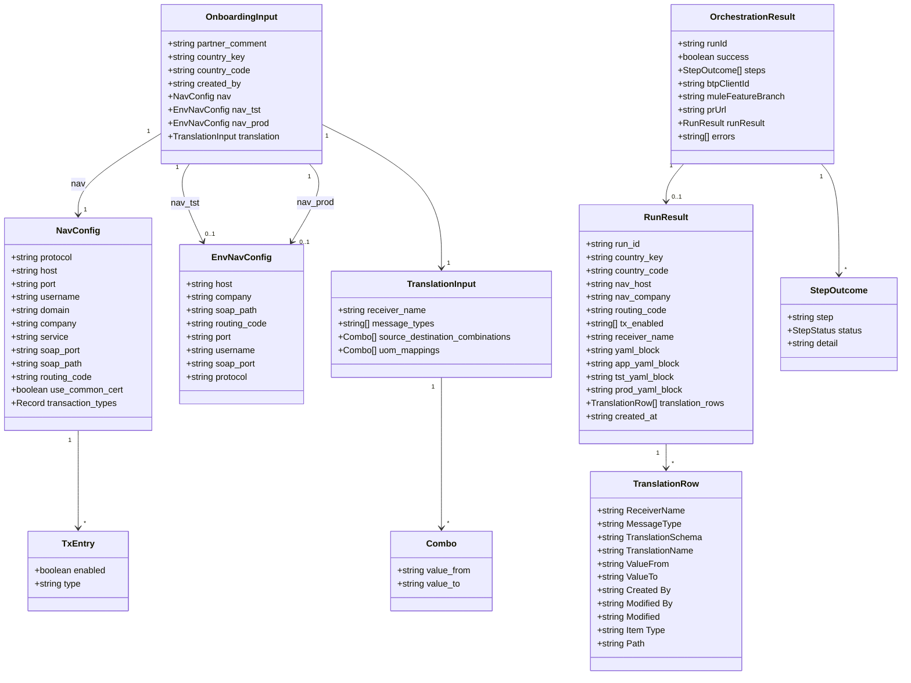

---

### LLD — File Store Layout

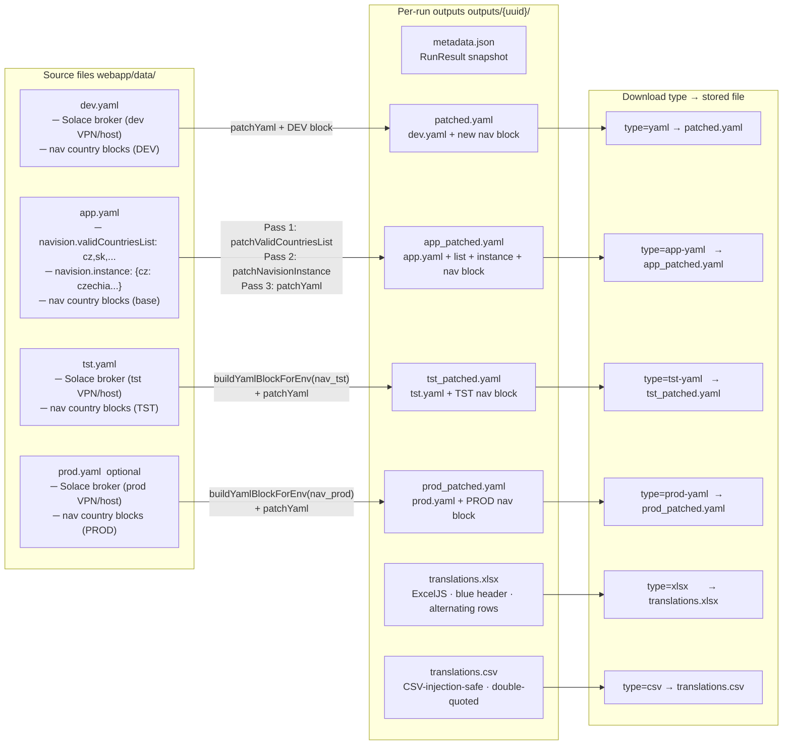

---

## Quick Start — Web App (Recommended)

### Prerequisites

- [Node.js LTS](https://nodejs.org/) (v20+)
- Windows: `winget install OpenJS.NodeJS.LTS`

### Run locally

```bash
cd 3pl-automation/webapp
npm install
npm run dev
```

Open **http://localhost:3000**

### What you'll see

| Page | URL | Description |
|---|---|---|
| Onboarding Form | `/` | Partner ID + DEV/TST/PROD NAV + transaction types + translation |
| Results | `/result/{runId}` | Per-env YAML previews, translation table, download buttons |
| API — run | `POST /api/run` | Steps 7+8: patch all YAMLs + generate translations |
| API — orchestrate | `POST /api/orchestrate` | All 10 steps; TODO steps return "skipped" |
| API — download dev | `GET /api/download/{runId}/yaml` | Patched dev.yaml |
| API — download app | `GET /api/download/{runId}/app-yaml` | Patched app.yaml |
| API — download tst | `GET /api/download/{runId}/tst-yaml` | Patched tst.yaml |
| API — download prod | `GET /api/download/{runId}/prod-yaml` | Patched prod.yaml |
| API — download xlsx | `GET /api/download/{runId}/xlsx` | Translation Excel |
| API — download csv | `GET /api/download/{runId}/csv` | Translation CSV |

### Form sections

| # | Section | Key fields |
|---|---|---|
| 1 | Partner Identification | Country key (YAML block key), country code (routing code), partner comment, created by |
| 2 | DEV NAV Config | Host, company, SOAP path, routing code, port, username — base used for app.yaml too |
| T | TST NAV Config | Toggle-enabled: host, company, SOAP path, routing code (TST-specific overrides) |
| P | PROD NAV Config | Toggle-enabled: host, company, SOAP path, routing code (PROD-specific overrides) |
| 3 | Transaction Types | 9 toggle cards — same across all environments |
| 4 | Translation Configuration | BTP ClientID, message types, plant/customer combos, UOM mappings |

---

## Quick Start — Python CLI

### Prerequisites

```bash
cd 3pl-automation/scripts
pip install -r requirements.txt
```

### Run with defaults

```bash
python scripts/patch_config.py
```

### Run with a specific input file

```bash
python scripts/patch_config.py \
  --input config/spl_france_input.json \
  --yaml  config/dev.yaml
```

### Dry run (preview only, no files written)

```bash
python scripts/patch_config.py --dry-run
```

---

## Quick Start — Python Orchestrator (all 10 steps)

Steps not yet implemented are **skipped with a WARN** — they do not stop the run.

```bash
# Run all steps
python scripts/orchestrator.py --input config/spl_france_input.json

# Dry run
python scripts/orchestrator.py --input config/spl_france_input.json --dry-run
```

### Step status in orchestrator output

```
[OK]     Step 7 — Mule YAML Patch
[OK]     Step 8 — Translation Rows
[SKIP]   Step 1 — BTP App Creation    ← blocked on Parag Shende
[SKIP]   Step 6 — Mule Feature Branch ← blocked on Sravani Kare + DevOps
[MANUAL] Step 10 — SharePoint / Manual Review
```

### Environment variables

Set in your shell or a `.env` file (never commit `.env`):

| Variable | Step | Notes |
|---|---|---|
| `BTP_API_HOST` | 1, 2 | BTP API management host |
| `BTP_TOKEN_URL` | 1, 2 | OAuth2 token endpoint |
| `BTP_CLIENT_ID` | 1, 2 | Service Key client_id |
| `BTP_CLIENT_SECRET` | 1, 2 | Service Key client_secret |
| `BTP_VALUEMAP_ARTIFACT_ID` | 2 | Artifact ID for ValueMapping |
| `BTP_VALUEMAP_PACKAGE_ID` | 2 | Package ID |
| `SOLACE_EP_API_TOKEN` | 3 | Solace Event Portal API token |
| `SOLACE_ENUM_ID` | 3 | Enumeration object ID |
| `SOLACE_EVENT_ID` | 3 | Event object ID |
| `SOLACE_PRODUCER_APP_ID` | 3 | Producer App ID |
| `SOLACE_CONSUMER_APP_ID` | 3 | Consumer App ID |
| `SOLACE_SEMP_HOST` | 4 | SEMP broker host |
| `SOLACE_VPN_UAT` / `SOLACE_VPN_PROD` | 4 | VPN names |
| `SOLACE_QUEUE_NAME` | 4 | Queue to patch |
| `SOLACE_GITHUB_REPO_OWNER` | 5 | GitHub org for Solace repo |
| `SOLACE_GITHUB_REPO_NAME` | 5 | Solace config repo name |
| `MULE_GITHUB_REPO_OWNER` | 6, 9 | GitHub org for Mule repo |
| `MULE_GITHUB_REPO_NAME` | 6, 9 | Mule repo name |
| `GITHUB_PAT` | 5, 6, 9 | GitHub Personal Access Token (auto-filled by Device Login; or set manually) |
| `GITHUB_OAUTH_CLIENT_ID` | UI | OAuth App Client ID — enables Device Code login in the GitHub section |
| `NOTIFICATION_CHANNEL` | 9 | `email`, `teams`, or `slack` |
| `REVIEWER_EMAIL` | 9 | Reviewer's email address |
| `TEAMS_WEBHOOK_URL` | 9 | Teams incoming webhook |

### Output files

```
outputs/{runId}/
├── metadata.json             ← RunResult (country, routing code, tx types, timestamps)
├── patched.yaml              ← dev.yaml with new nav block appended
├── app_patched.yaml          ← app.yaml with validCountriesList + instance + nav block
├── tst_patched.yaml          ← tst.yaml with TST nav block (if nav_tst provided)
├── prod_patched.yaml         ← prod.yaml with PROD nav block (if nav_prod provided)
├── translations.xlsx         ← import into SharePoint Translation list
└── translations.csv          ← same data as CSV
```

---

## Input JSON Schema

Copy `config/sample_onboarding_input.json` and fill in all required fields.

```jsonc
{
  "partner_comment": "Added France for SPL partner",
  "country_key":     "france",          // REQUIRED — full nav block key, lowercase letters only
  "country_code":    "fr",              // REQUIRED — short routing code (validCountriesList + instance)
  "created_by":      "Your Name",

  "nav": {
    "protocol":     "https",
    "host":         "azr-xxx1234.mars-ad.net",          // REQUIRED — DEV NAV server hostname
    "port":         "7124",
    "username":     "SVC_UAT_MULESOFT",
    "domain":       "mars-ad.net",
    "company":      "Company(UAT - Royal Canin France)", // REQUIRED — exact NAV company string
    "service":      "InterfaceWebServices",
    "soap_port":    "7124",
    "soap_path":    "/sop_fra_uat_01/WS/.../Codeunit/InterfaceWebServices?wsdl", // REQUIRED
    "routing_code": "NAV_FM_IN_UAT_FRA",                // REQUIRED — MuleSoft routing code
    "use_common_cert": true,
    "transaction_types": {
      "sal_008": { "enabled": true,  "type": "SHIPMENT" },
      "sal_011": { "enabled": true,  "type": "SALES_RETURN_RECEIPT" },
      "pur_019": { "enabled": true,  "type": "RECADV" },
      "man_001": { "enabled": false, "type": "FINISHED_GOOD" },
      "inv_002": { "enabled": true,  "type": "RECLASSMENT" },
      "inv_003": { "enabled": true,  "type": "INVENTORY" },
      "inv_004": { "enabled": true,  "type": "STOCK_ADJUSTMENT" },
      "wms_004": { "enabled": false, "type": "TO_SHIP_CONFIRMATION" },
      "wms_005": { "enabled": false, "type": "TO_REC_CONFIRMATION" }
    }
  },

  // TST-specific overrides — omit if tst.yaml patching not needed
  "nav_tst": {
    "host":         "azr-xxx1234-tst.mars-ad.net",
    "company":      "Company(TST - Royal Canin France)",
    "soap_path":    "/sop_fra_tst_01/WS/TST - Royal Canin France/Codeunit/InterfaceWebServices?wsdl",
    "routing_code": "NAV_FM_IN_TST_FRA"
  },

  // PROD-specific overrides — omit if prod.yaml patching not needed
  "nav_prod": {
    "host":         "azr-xxx1234-prod.mars-ad.net",
    "company":      "Company(PROD - Royal Canin France)",
    "soap_path":    "/sop_fra_prd_01/WS/PROD - Royal Canin France/Codeunit/InterfaceWebServices?wsdl",
    "routing_code": "NAV_FM_IN_PRD_FRA"
  },

  "translation": {
    "receiver_name": "petc-rc-navision-3plspl-sys",     // REQUIRED — BTP ClientID = Solace Partner ID
    "message_types": ["despatchStock"],
    "source_destination_combinations": [
      { "value_from": "PLANT-FR1-PLANT-FR2",    "value_to": "spl_001" },
      { "value_from": "PLANT-FR1-CUSTOMER-FR3", "value_to": "spl_002" }
    ],
    "uom_mappings": [
      { "value_from": "EA", "value_to": "UNIT" }
    ]
  }
}
```

### All valid transaction codes

| Code | Type | Used by |
|---|---|---|
| `sal_008` | SHIPMENT | All countries |
| `sal_011` | SALES_RETURN_RECEIPT | CZE, POL, SVK, ZAF |
| `pur_019` | RECADV | All countries |
| `man_001` | FINISHED_GOOD | CZE, POL, SVK |
| `inv_002` | RECLASSMENT | All countries |
| `inv_003` | INVENTORY | All countries |
| `inv_004` | STOCK_ADJUSTMENT | All countries |
| `wms_004` | TO_SHIP_CONFIRMATION | ZAF only |
| `wms_005` | TO_REC_CONFIRMATION | ZAF only |

---

## MuleSoft YAML — What Gets Updated

A single automation run patches **all four YAML files** in one go:

### app.yaml — 3 changes

**1. `navision.validCountriesList` — country code appended:**
```yaml
# Before
  validCountriesList: "cz,sk,pl,eka,za"

# After
  validCountriesList: "cz,sk,pl,eka,za,fr"
```

**2. `navision.instance` — new routing entry added:**
```yaml
# Before
  instance:
    cz: "czechia"
    za: "southafrica"

# After
  instance:
    cz: "czechia"
    za: "southafrica"
    fr: "france"
```

**3. Nav block appended at end of file** (same as dev.yaml below)

### dev.yaml / tst.yaml / prod.yaml — nav block appended

```yaml
#Added France for SPL partner
france:
   protocol: "https"
   host: "azr-xxx1234.mars-ad.net"
   port: "7124"
   username: "SVC_UAT_MULESOFT"
   domain: "mars-ad.net"
   company: "Company(UAT - Royal Canin France)"
   service: "InterfaceWebServices"
   soap.port: "7124"
   soap.path: "/sop_fra_uat_01/WS/UAT - Royal Canin France/Codeunit/InterfaceWebServices?wsdl"
   routing.code: "NAV_FM_IN_UAT_FRA"
   transactiontype:
     sal_008: "SHIPMENT"
     sal_011: "SALES_RETURN_RECEIPT"
     pur_019: "RECADV"
     inv_002: "RECLASSMENT"
     inv_003: "INVENTORY"
     inv_004: "STOCK_ADJUSTMENT"
```

> TST and PROD blocks use their own `host`, `company`, `soap_path`, and `routing_code` from `nav_tst` / `nav_prod`. All other fields (port, username, domain, service, transaction types) fall back to the base `nav` values.

**Guards (all files):**
- Duplicate-key check: fails with a clear error if the country already exists in any file
- Indentation preserved: 3-space properties, 5-space transaction entries
- All existing content (other countries + comments) left untouched

---

## Translation Table — What Gets Generated

Rows match the SharePoint `TranslationData_TST` list schema exactly:

| Column | Example value |
|---|---|
| ReceiverName | `petc-rc-navision-3plspl-sys` |
| MessageType | `despatchStock` |
| TranslationSchema | `INTERNAL_TO_EXTERNAL` |
| TranslationName | `sourceDestinationCombination` or `uom` |
| ValueFrom | `PLANT-FR1-PLANT-FR2` (internal) |
| ValueTo | `spl_001` (3PL code) |
| Created By / Modified By | from `created_by` field in JSON |
| Modified | timestamp of run |
| Item Type | `Item` |
| Path | `sites/pubsubpatterntesting/Lists/TranslationData_TST` |

---

## Team Dependencies & Open Items

### BTP Team (contact: Parag Shende)

| # | Action needed | Blocks |
|---|---|---|
| 1 | Share Postman collection + payloads for ValueMapping Upsert, SaveAsVersion, Deploy APIs | Step 2 automation |
| 2 | Confirm exact API endpoint for ClientID/Secret generation | Step 1 automation |
| 3 | D3 approval process decision: automate App Creation via API or keep manual? | Step 1 |
| 4 | Provision Service Instance + Service Key for BTP API access | Step 2 |
| 5 | Confirm: are 3PL ValueMapping entries editable after initial config? | Step 2 |

### Solace Team (contact: Rohini Mondal)

| # | Action needed | Blocks |
|---|---|---|
| 1 | Share OAuth token / API credentials for Solace Event Portal API | Step 3 automation |
| 2 | Provide IDs of existing Enum, Event, Producer App, Consumer App objects | Step 3 |
| 3 | Share Postman collection for 5-step Event Portal sequence | Step 3 |
| 4 | Confirm SEMP API endpoint + auth method for queue subscription PATCH | Step 4 |
| 5 | Share snapshot of existing queue subscriptions | Step 4 |
| 6 | Provide input.json schema + sample file (ref: Confluence RDP page) | Step 5 |
| 7 | Confirm repo URL, file path, branch naming for Git automation | Step 5 |

### MuleSoft Team (contact: Sravani Kare)

| # | Action needed | Blocks |
|---|---|---|
| 1 | Confirm GitHub repo URL for the MuleSoft project | Step 6, 9 |
| 2 | Share GitHub PAT or confirm Service Principal for branch creation + PR | Step 6, 9 |
| 3 | Provide GitHub reviewer handle + email for PR notification | Step 9 |
| 4 | Confirm notification channel: email / Teams / Slack | Step 9 |
| 5 | Confirm DEV deployment: auto on merge or manual trigger? | Step 10 |

### Azure / DevOps Team

| # | Action needed | Blocks |
|---|---|---|
| 1 | Provision Azure Service Principal with branch-create rights on Solace + Mule repos | Steps 5, 6 |
| 2 | Define Key Vault path for ClientID, secrets, service account creds | All API steps |
| 3 | Confirm notification relay: SendGrid / Azure Communication Services / SMTP | Step 9 |

---

## Azure Deployment

### Azure App Service (Node 20 LTS)

```bash
cd webapp
npm run build

az webapp up \
  --name 3pl-onboarding \
  --resource-group <your-rg> \
  --runtime "NODE:20-lts" \
  --sku B1

az webapp config set \
  --name 3pl-onboarding \
  --resource-group <your-rg> \
  --startup-file "node server.js"
```

### Environment variables (App Service → Configuration → Application Settings)

| Variable | Value | Notes |
|---|---|---|
| `NODE_ENV` | `production` | Required |
| `NEXT_PUBLIC_BASE_URL` | `https://<your-app>.azurewebsites.net` | Used by result page to fetch run data |
| `SECRET_KEY` | `<random 32-char string>` | Optional, for session security |

### Keep data YAMLs in sync

After each patching run, sync the source files so the next run patches the updated state:

```bash
# Windows — copy patched files back to data/
copy webapp\outputs\{runId}\app_patched.yaml webapp\data\app.yaml
copy webapp\outputs\{runId}\patched.yaml      webapp\data\dev.yaml
copy webapp\outputs\{runId}\tst_patched.yaml  webapp\data\tst.yaml
copy webapp\outputs\{runId}\prod_patched.yaml webapp\data\prod.yaml
```

---

## Contributing

### Adding a new country via CLI

```bash
# 1. Copy input template
copy config\sample_onboarding_input.json config\{partner}_{country}_input.json

# 2. Fill in all REQUIRED fields — include nav_tst and nav_prod if available

# 3. Dry-run first
python scripts/patch_config.py --input config/{partner}_{country}_input.json --dry-run

# 4. Run the automation
python scripts/patch_config.py --input config/{partner}_{country}_input.json

# 5. Review outputs/{runId}/
#    - app_patched.yaml   → commit to feature branch (app.yaml)
#    - patched.yaml       → commit to feature branch (dev.yaml)
#    - tst_patched.yaml   → commit to feature branch (tst.yaml)
#    - prod_patched.yaml  → commit to feature branch (prod.yaml)
#    - translations.xlsx  → import to SharePoint

# 6. Raise PR and notify Sravani Kare
```

### Adding a new country via Web App

1. Open http://localhost:3000 (or the Azure URL)
2. Fill in the 4-section form — tick **Include TST** and **Include PROD** to patch those environments
3. Click **Run Automation**
4. Review the per-environment YAML block previews and translation table
5. Download all patched files and follow the PR + SharePoint steps

### Regenerate the tracker / requirements Excels

```bash
cd scripts
python create_tracker_excel.py
python create_onboarding_excel.py
# Outputs written to docs/
```

### File naming conventions for input JSONs

```
config/{partner_code}_{country_code}_input.json
# Examples:
#   spl_france_input.json
#   als_southafrica_input.json
#   pnp_czechia_input.json
```

---

*EOS Transformation Delivery Team · iHub · Internal use only*
